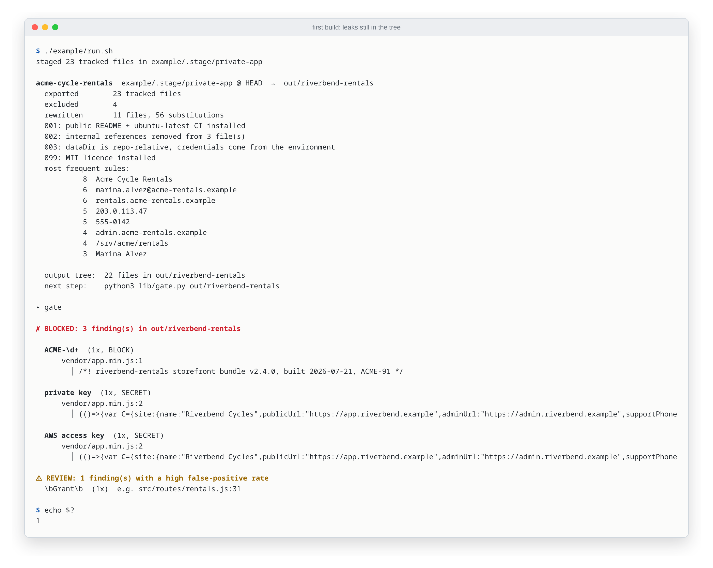
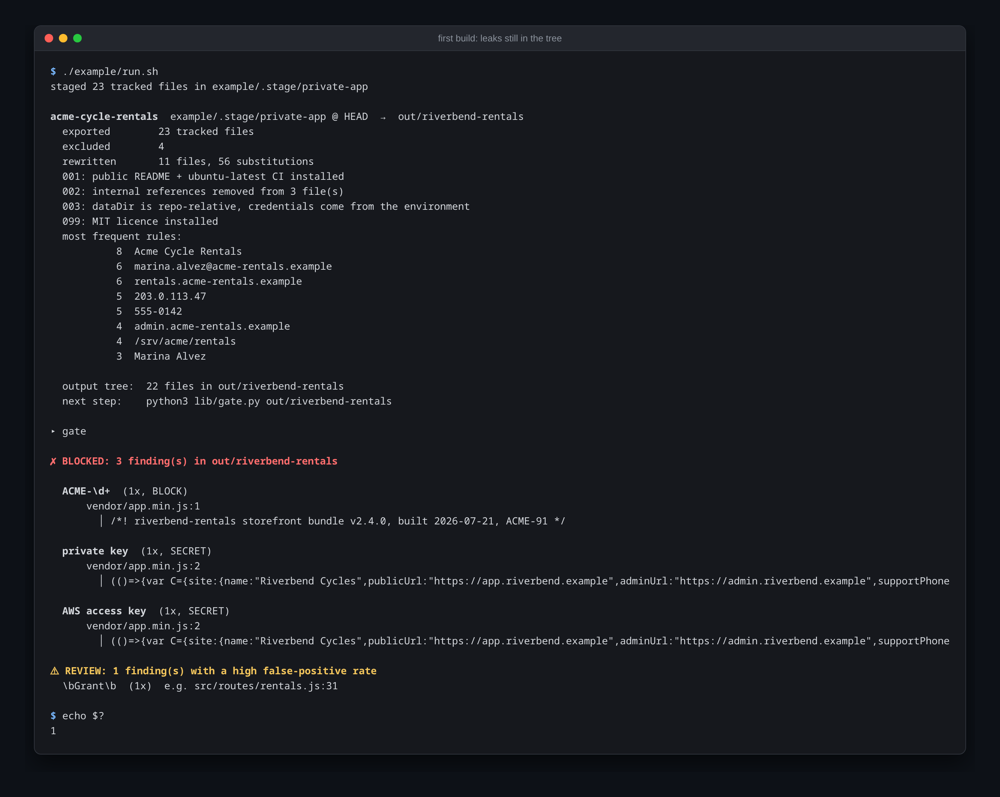
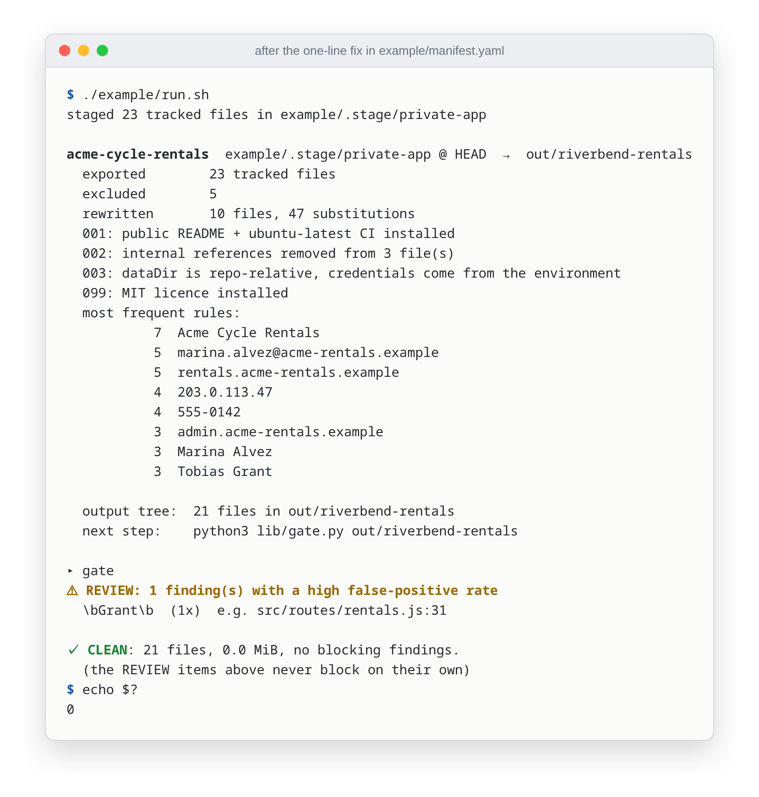

# safe-code-publisher

[](https://github.com/eranoix/safe-code-publisher/actions/workflows/ci.yml) [](LICENSE) 

**Publishes a clean copy of a private project and refuses if any personal data is left in it.**

*In plain words:* Sometimes you want to show work you did in private, but the files are full of things that must stay private, like names, addresses and passwords. Cleaning them by hand is slow, and it is easy to miss one. This tool makes the clean public copy automatically and then checks every file. If anything personal is left behind, it refuses to publish and points to the exact file and line. Several of the other projects on this profile were published with it.

<p align="center"> </p>

Derives a public repository from a private one (dropping what must not leave,
substituting identities, applying versioned transformations) and refuses to
hand over the copy when any check fails.

## The problem

You built something worth showing and you cannot show it. There is a
production address in a config file, a client's name in a comment, a directory
named after an internal ticket, and your own phone number in the README.

None of that is the interesting part of the work, and all of it has to go
before anyone outside sees the repository.

The usual answers work exactly once. Copy the tree and run `sed`; or read the
diff before pushing and redact what you notice. Both are a single manual pass,
and the second time (when the private repository has moved on and you
sanitize from memory) is where the leak happens.

The difference here is not the sanitizing. It is what happens when the
sanitizing is wrong: a tool that gets it wrong publishes, and you find out
afterwards. This one builds the tree, then refuses to certify it, and names
the file, the line and the rule.

## Requirements

- **git**, on the `PATH`. The tool exports from a git ref, and the example
  turns its fixture into a throwaway repository before each build.
- **Python 3.12 or newer** with **PyYAML**. Tested on 3.12 and 3.13.
- **Node 22**, only for the optional last step (`npm test` in the published
  example tree).

Everything runs on Linux and macOS; `example/run.sh` and `example/stage.sh`
need bash.

## The demonstration

From the root of a clone of this repository:

```bash
# PyYAML. Recent Debian, Ubuntu and Homebrew Pythons refuse a plain
# `pip install` outside a virtual environment, so make one:
python3 -m venv .venv
. .venv/bin/activate
pip install pyyaml
# (or, on Debian and Ubuntu: sudo apt install python3-yaml)

./example/run.sh
```

`example/private-app/` is an invented project: the booking service of a bike
rental shop, 23 files, with leaks planted in it, one per class. Every value
in it that looks private is verifiably not: the addresses are `.example`
(RFC 2606), the IP is from the RFC 5737 documentation range, the phone numbers
are `555-01xx`. The first build does not produce a publishable tree:

```
staged 23 tracked files in example/.stage/private-app

acme-cycle-rentals  example/.stage/private-app @ HEAD  →  out/riverbend-rentals
  exported        23 tracked files
  excluded        4
  rewritten       11 files, 56 substitutions
  001: public README + ubuntu-latest CI installed
  002: internal references removed from 3 file(s)
  003: dataDir is repo-relative, credentials come from the environment
  099: MIT licence installed
  most frequent rules:
           8  Acme Cycle Rentals
           6  marina.alvez@acme-rentals.example
           6  rentals.acme-rentals.example
           5  203.0.113.47
           5  555-0142
           4  admin.acme-rentals.example
           4  /srv/acme/rentals
           3  Marina Alvez

  output tree:  22 files in out/riverbend-rentals
  next step:    python3 lib/gate.py out/riverbend-rentals

▸ gate

✗ BLOCKED: 3 finding(s) in out/riverbend-rentals

  ACME-\d+  (1x, BLOCK)
      vendor/app.min.js:1
        │ /*! riverbend-rentals storefront bundle v2.4.0, built 2026-07-21, ACME-91 */

  private key  (1x, SECRET)
      vendor/app.min.js:2
        │ (()=>{var C={site:{name:"Riverbend Cycles",publicUrl:"https://app.riverbend.example",adminUrl:"https://admin.riverbend.example",supportPhone

  AWS access key  (1x, SECRET)
      vendor/app.min.js:2
        │ (()=>{var C={site:{name:"Riverbend Cycles",publicUrl:"https://app.riverbend.example",adminUrl:"https://admin.riverbend.example",supportPhone

⚠ REVIEW: 1 finding(s) with a high false-positive rate
  \bGrant\b  (1x)  e.g. src/routes/rentals.js:31
```

Exit status 1. Three findings, all in one file, and everything the pipeline
was asked to do it did: 56 substitutions landed, the internal ticket keys were
stripped from the sources, the credentials were moved out of the config. Look
at the blocked excerpt: the domain inside that bundle *was* rewritten, it
says `riverbend-rentals`.

`vendor/app.min.js` is build output: a second copy of the source, frozen at
the moment someone last ran `npm run build:web`. No transformation over `src/`
reaches it. A check that read the sources would have certified this build.

The fix is one line in `example/manifest.yaml`, under `exclude:`, where the
comment says MISSING ON PURPOSE:

```yaml
      - "vendor/app.min.js"
```

Build output does not belong in a public repository to begin with; the public
README already tells the reader to run the build. Run `./example/run.sh`
again:

<picture><source media="(prefers-color-scheme: dark)" srcset="docs/screenshots/02-clean-dark.png"></picture>

```
  exported        23 tracked files
  excluded        5
  rewritten       10 files, 47 substitutions
  …

▸ gate
⚠ REVIEW: 1 finding(s) with a high false-positive rate
  \bGrant\b  (1x)  e.g. src/routes/rentals.js:31

✓ CLEAN: 21 files, 0.0 MiB, no blocking findings.
  (the REVIEW items above never block on their own)
```

Exit status 0. The publishable tree is `out/riverbend-rentals`, and its tests
pass:

```bash
cd out/riverbend-rentals && npm test
```

`example/README.md` walks through all five planted leaks and which part of the
gate catches each one. To start over from the leaked state, undo the one-line
edit (`git checkout example/manifest.yaml`); `run.sh` rebuilds `out/` and
`example/.stage/` from scratch every time.

## How it refuses

Every check below exists because something got through once. The docstring on
each one records which.

**The scan runs over the output tree, never over the sources.** Minified
bundles, compiled assets and vendored copies are separate files that no
source-level transformation reaches. This is the failure the demonstration
above is built around.
→ `lib/gate.py`

**Paths are scanned, not only bytes.** An early version read file contents
only, and passed a directory holding five perfectly clean files whose *name*
carried an internal ticket key and a date. A file name is as public as the
file: it appears in the tree listing, in the URL and in code search. Path
findings are reported at line 0.
→ `lib/gate.py:scan_path`

**Skipping is decided per path component, never by substring.** The first
version tested `s in joined`, and `.git` is a substring of `.github`, so no
CI workflow was ever scanned, and a workflow is exactly where deploy
hostnames, runner labels and secret names live. Found by comparing the scanned
file count against `git ls-files`: 13 against 15.
→ `lib/gate.py:should_skip`

**Credentials are matched by shape, independently of the map.** Private keys,
cloud access keys, forge tokens, payment keys, JWTs. This layer exists to
catch the secret that was never catalogued: nobody adds their own leaked key
to a deny-list, because they do not know it is there. The demonstration finds
two this way, neither of them named anywhere in the identity map. Fixtures
that exist to prove redaction works are allowlisted by path fragment *and*
value, never by path alone.
→ `lib/gate.py:SECRET_PATTERNS`

**Binaries are read as bytes.** A `.docx` carries the author's name in its
metadata and a `.png` carries EXIF. Literal matches only there: regex over
arbitrary bytes is noise.
→ `lib/gate.py:scan_binary`

**Two tiers, because a gate nobody reads is not a gate.** `block` stops the
build. `review` is listed and never blocks on its own, for terms with a high
false-positive rate, such as a surname that is also an ordinary verb three
lines away. The demonstration ends on one of those.

**The identity map is refused inside the output tree.** It would be the worst
leak available: the concentrated list of everything you were hiding. The check
is by file name, which is why the map that ships with this repository is
called `example/identities.example.yaml` and not `identities.yaml`.
→ `lib/gate.py:main`

**Substitution decides text by content, not by extension.** The first version
used an allowlist of extensions and left systemd unit files untouched, with an
absolute path and a username intact. An extension list always forgets one.
→ `lib/scrub.py:is_text`

**File names are substituted too.** Content can be spotless while
`billing_<client>_test.go` tells the whole story from the tree listing.
→ `lib/scrub.py:rename_paths`

**A transformation that is not in the manifest is an error, not a no-op.**
Order matters, so the manifest lists transformations explicitly, and the cost
of an explicit list is that a file written and never registered silently does
not run, bringing back the defect it fixed. The scrub compares the directory
against the list and stops.
→ `lib/scrub.py:apply_patches`

**The export is from a git ref, never from the working directory.** An
untracked file can then never enter the public tree by accident, and whatever
`.gitignore` already hides is gone for free.

**Exclusion happens before substitution.** A document describing a client's
internal process has to disappear, not become a document about "Acme".
Substitution fixes values; it does not fix audience.

## Configuring it for your own repository

Five declarations, and none of them is code.

**1. `manifest.yaml`: what leaves, and what runs on the way out.**

```yaml
projects:
  your-project:
    src: /path/to/the/private/repo
    ref: HEAD
    public_repo: the-public-name
    exclude:
      - "docs/runbook.md"
      - "deploy/dated-backup"
      - "deploy/dated-backup/**"
    patches:
      - 001-readme-and-ci.py
      - 099-license.py
```

Prefer to exclude too much. A gap in the public repository is a gap; a
leftover is a leak.

**2. `publisher:`: who signs the published commits.**

```yaml
publisher:
  name: your-handle
  email: you@example.com
  forge_host: github.com     # optional
  forge_owner: your-handle   # optional
```

Required, with no default. A tool that guesses here would sign someone else's
name to commits it wrote, and the failure is silent: you find out when the
history is already public. Without `forge_owner` the remote is simply left
unconfigured, and the run says so; it never invents a destination.

**3. The identity map: what every real value becomes.**

```yaml
entries:
  - match: "ops@your-company.example"
    replace: "alex@riverbend.example"
    tier: block
  - match: 'ACME-\d+'
    re: true
    tier: block          # no replace, see below
  - match: '\bGrant\b'
    re: true
    tier: review
```

Order matters: substitution runs top to bottom, so the most specific entry
comes first: the address before the domain before the brand. Reversed, an
e-mail address is half-rewritten and stays traceable.

An entry with `tier: block` and **no** `replace` is deliberate. Renaming an
internal ticket key publishes the same fact in a costume, so there is no safe
stand-in to invent: the gate blocks it and a transformation has to delete it.

Keep the real map outside the tree of every repository that goes public. It is
the one file whose loss is worse than the leak it prevents.

**4. `gate.exceptions:`: the few places a real value legitimately appears.**

```yaml
gate:
  exceptions:
    trees:
      your-handle: [your-handle]   # your profile repository is named after you
    paths:
      - {path: LICENSE, identity: your-handle}
```

Both forms need the pair: a tree or a path **and** the identity excused there.
Never a path alone: an exception that says "trust this file" stops being an
exception and becomes a hole, and the day something else leaks into that file
nothing reports it.

The rest of `gate:` is what the scan needs to know about your project, and
every key is optional. Absent, the gate is at its strictest.

```yaml
gate:
  ref_prefixes: [ACME, SHOP]      # ACME-42 and SHOP-7 block, in content and paths
  ref_fixtures:                   # files where a ticket key IS the test data
    - test/board.test.js
  first_party_vendor: [acme]      # vendor/acme/ is your code: scan it
  secret_fixtures:                # fake credentials planted by a test
    - { path: redact.test.js, value: ghp_fake }
```

`lib/history.py <tree> --project <name>` turns `projects.<name>.history`
into one commit per entry (`paths`, `subject`, optional `body`); without it
the public tree is a single commit.

**5. `patches/`: the transformations the private repository never receives.**

Numbered scripts, run in manifest order with the working directory set to the
output tree. This is where the public README, the CI workflow and the LICENSE
come from, so the running system stays untouched and the build stays
reproducible.

Prefer a script over a `.patch` diff: a diff carries context lines, and the
context has already been through substitution, so changing one stand-in
invalidates the patch, with an error that reads like a code error. A script
anchors on identifiers, which substitution does not touch.

The four in `example/patches/` are worth reading before writing your own; each
docstring states the defect that produced it.

## Tests

CI proves the gate in both directions on every push. It runs
`example/run.sh` on the leaking sample and requires a refusal, applies the
one-line fix this README describes, runs it again and requires a clean pass,
then runs the published sample app's own `npm test` to show that sanitizing did
not break it. A second, independent job scans the working tree and the whole
history with [gitleaks](https://github.com/gitleaks/gitleaks), so a secret the
gate's own patterns missed would still fail the build.

## What this does not do

- **It is not a security product.** It has not been audited and makes no
  guarantee. It is a build step with a refusal in it.
- **It does not replace reading the diff before you publish.** It removes the
  classes you declared. It has no opinion about anything else in the tree.
- **It does not know what is secret in a domain you have not described.** The
  credential patterns are a fixed list of well-known shapes. Everything
  specific to you (hostnames, client names, internal paths) has to be in the
  map, and writing that map is the work. A missing entry is a silent pass.
- **It does not know your tracker's ticket prefixes.** Declare them in
  `gate.ref_prefixes`, or block them in the identity map as a `tier: block`
  entry with no `replace`.
- **It does not sanitize git history.** The private history is not rewritten
  and not exported; the public repository gets a history built from the clean
  tree.
- **It does not push.** Publishing is a separate step, taken after the gate
  has passed.

## Layout

| | |
|---|---|
| `lib/gate.py` | the scan. Exit 0 clean, 1 blocking finding, 2 usage error |
| `lib/scrub.py` | export from a ref, exclude, substitute, transform |
| `lib/internal_refs.py` | one definition of "internal reference", shared by the gate and the transformation that strips them, so they cannot drift apart |
| `lib/history.py` | builds the public repository's history from the clean tree, signed as `publisher:`, one commit per `history:` entry (`--project`) |
| `example/` | the invented private project, its manifest, its map and its transformations; see `example/README.md` |

`.github/workflows/ci.yml` runs the demonstration on every push: it asserts
that the leaked state is refused, applies the one-line fix, and asserts that
the fixed state is certified. Every claim on this page is re-proved on each
commit.
